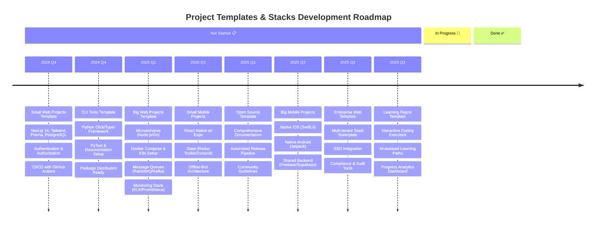

# Our Organization

Welcome to our organization's GitHub profile! We're dedicated to building innovative solutions that empower businesses and developers.

## 🚀 Timeline

# Organization Timeline

To display our organization's journey, we use Mermaid.js which is natively supported by GitHub! 

## 💻 Core Technologies

### Languages & Frameworks
- JavaScript/TypeScript ( React, Node.js, ExpressJS )
- Python ( Django, FastAPI )
- Dart ( Flutter, DartFrog )

### Infrastructure
- Docker
- Supabase / Firebase

## 🛠 Services

### Developer Tools
- Code Quality Tools
- Security Scanning
- Package Registry

### Cloud Solutions
- Database Management
- API Gateway Services

## 📄 License

Most of our projects are licensed under the MIT License - see individual repositories for specific terms.

---
Made with ❤️ by our global team
